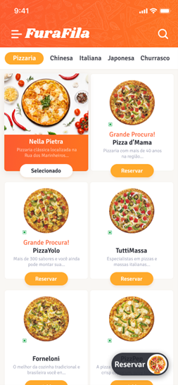
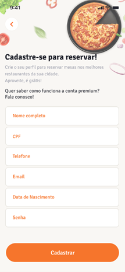
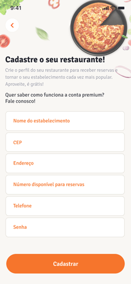
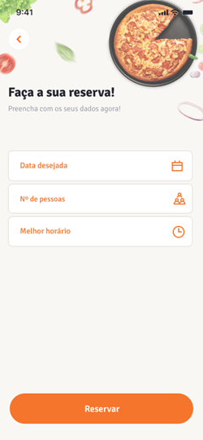

# Projeto FuraFila

(Em desenvolvimento a API Rest - Back End)

O seguinte projeto visa construir um aplicativo inovador na área gastronômica chamado "FuraFila", voltado para pessoas que sentem a necessidade de realizar uma reserva de mesas em restaurantes cadastrados, que simplifique a interação entre clientes e restaurantes, visando melhor satisfação, conforto e comodidade ao estabelecer uma forte relação entre consumidores e restaurantes parceiros, reduzindo o tempo de espera e otimização do processo de alocação de mesas nos estabelecimentos.

## Índice
- <a href="#tecnologias-utilizadas"> Tecnologias utilizadas</a>

- <a href="#funcionalidades-do-projeto">Funcionalidades do Projeto</a>

- <a href="#regras-de-negócio-validadas-pelo-sistema">Regras de negócio validadas pelo sistema</a>

- <a href="#protótipo-do-projeto">Protótipo do Projeto</a>

- <a href="#pessoas-autoras"> Pessoas autoras</a>

## Tecnologias utilizadas
    
   - Spring Boot 3
   - Java 17
   - Lombok
   - MySQL / Flyway
   - JPA / Hibernate
   - Maven
   - Postman 
      

## Funcionalidades do Projeto

- Login
- CRUD (Create, Read, Update e Delete) 
- Validações
- Paginação e ordenação
- Agendamento e cancelamento

## Regras de negócio validadas pelo sistema

- Horário das reservas entre 11:00 às 22:00 hrs.
- As reservas tem duração de 2 horas.
- As reservas devem ser agendadas com antecedência mínima de 30 minutos.
- Não permitir o agendamento de reservas com clientes inativos no sistema.
- Não permitir o agendamento de reservas com restaurantes inativos no sistema.
- Não permitir o agendamento de mais de uma reserva no mesmo dia para um mesmo cliente.
- Não permitir o agendamento de novas reservas caso a capacidade do número de pessoas disponíveis para reservas no restaurante já tenha sido alcançada.
- A escolha do restaurante é opcional, caso o cliente tenha interesse, o sistema deve escolher aleatoriamente algum restaurante disponível na data/hora preenchida. 

## Protótipo do Projeto

### Tela Inicial

### Tela de cadastro do Cliente

### Tela de cadastro do Restaurante

### Tela de reservas

## Pessoas autoras

Alexandre Fattori;
Igor Eloi Dias Branco;
Paula Reis Colombo;

